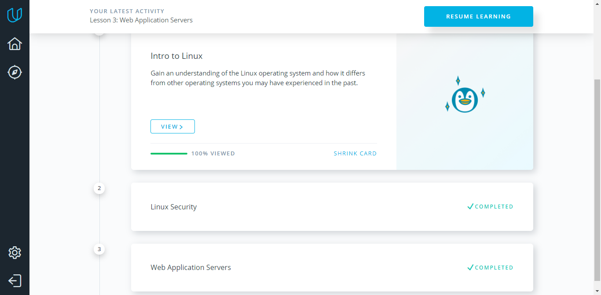
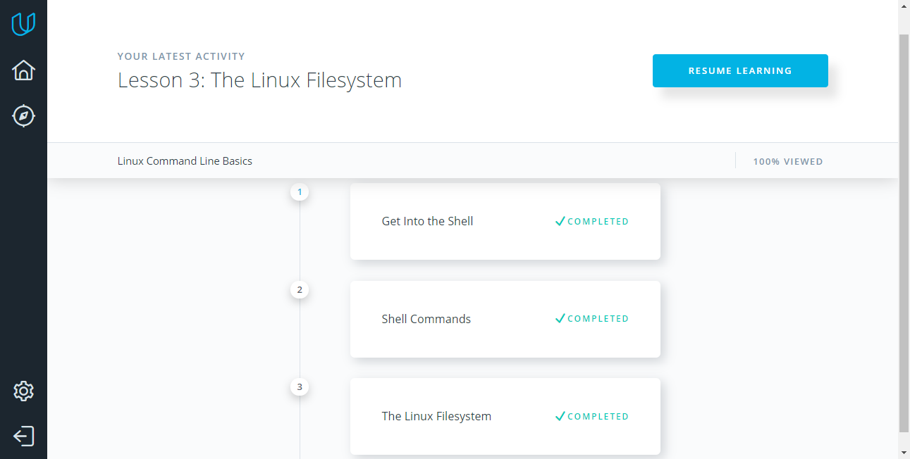
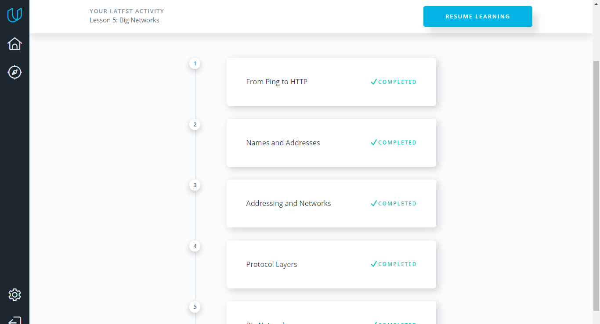
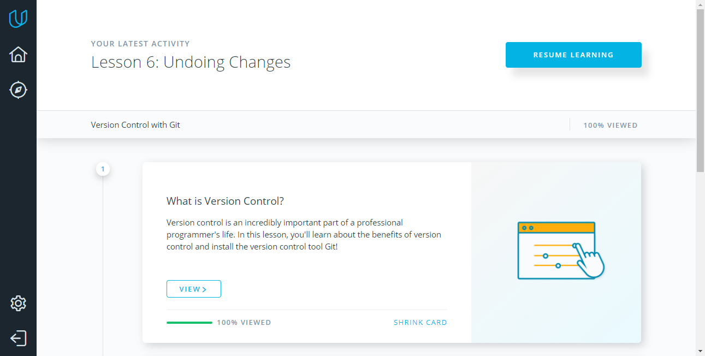
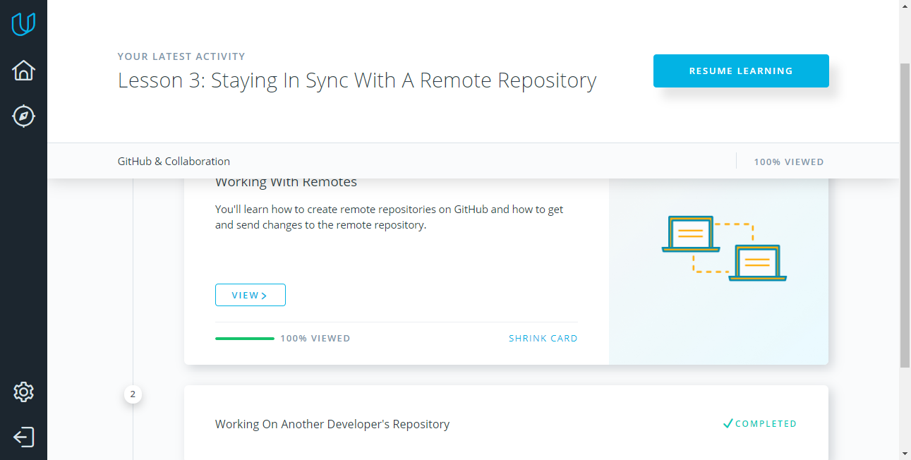
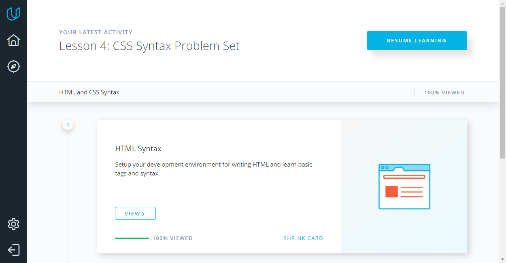
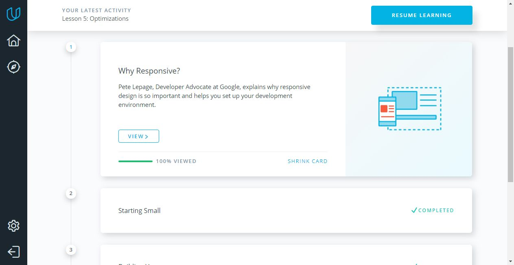
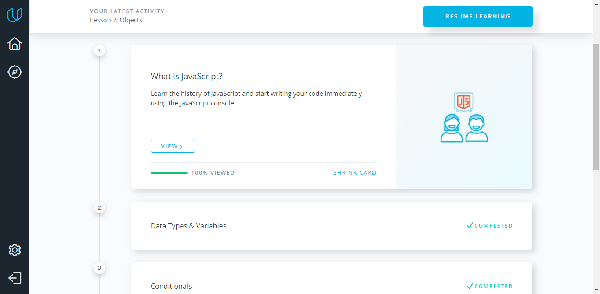

# Kottans frontend course

### Task 0

Just finished [How to use Git and GitHub](https://www.udacity.com/course/how-to-use-git-and-github--ud775) and [try.github.io](https://try.github.io/levels/1/challenges/1) 

Udacity course is good one. Very straightforward and gives a solid background in using github. After this course try.github.io is needed just to repeat basic concepts once again from different point of view. 
Highly recommend additional reading [Git на практике](https://sohabr.net/habr/post/342116/) which is describing how it looks like on practice.

* handling conflicts 
* not sure there was something like that
* I think there's stiil a lot to learn to do something with what I learned

---

### Task 1 

I'm still not able to do vagrant ssh the way its described in the lessons. Connecting through the putty and some magic :) 
Update: ssh vagrant@127.0.0.1 -p 2222 -o IdentitiesOnly=yes helped me...

* no doubt vagrant is totally new for me
* command line in Linux is full of surprises: I've been using it since early 2000 but it keeps surprising me
* if I ever again sould be installing Windows, I would never, never use cyrillic for user name

 

 

---

### Task 2

[Oh shit, git!](http://ohshitgit.com/) - nice short list "just in case" 
[Flight rules for git](https://github.com/k88hudson/git-flight-rules) - I kept it for further use

 

---

### Task 3
 
Intro to HTML & CSS is good basic course, but further research absolutely needed after completion. And this is where links from kottans help a lot.
 

---

### Task 4
  
Responsive Web Design Fundamentals - gives a very straightforward explanation of what "responsive" means and how to implement some basic approaches. 
 

    

 

---

### Task 5 
 
Intro to JS is good course but a little bit accentuated on donuts :)
 

